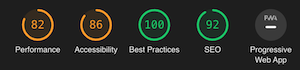
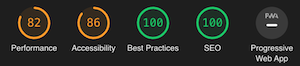
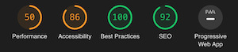
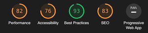
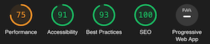

# Projeto do BOOTCAMP de JAMStack da Alura

## Desafio do Módulo 03

A idéia do desafio deste módulo é acrescentar a lista de projetos/protifólio baseado nos repositórios publicos existentes no GitHub.
> Para ficar aderente ao design do projeto, ao invés de colocar a lista na página Sobre Mim, foi colocar no item Projetos do Menu.

- <ins>Ajustes no componente ```MenuArea```</ins>: foi atualizado para utilizar o componente de link do _NextJS_, porém, estilizado para seguir o _design_ do projeto

- <ins>Módulo de API</ins>: foi criado um módulo no caminho ```src/data``` (utilizado como ```ProjectAPI```) para conter aos acessos à api, inclusive aos dados do arquivo ```db.json``` proposto no desafio.

- <ins>Visualização de Projetos</ins>: adicionado o sistema de ver a tela de projetos, com a respectiva listagem e, quando clicar em em projeto específico, abrir uma página que mostra os detalhes do mesmo.
> **OBS.:** foi criado um processo de controle nas chamadas do ```getStaticProps``` para evitar ficar chamando a API do GitHub e obter um erro de 403 (rate limit), dificultando assim os testes.

- <ins>Formulário de Contato</ins>: migrado para o componente ```Form``` criado durante o desafio extra do módulo 2. Este componente imita o [Formik] com as tags ```Form, Form.Row, Form.Field``` e ```Form.Button``` abstraindo a mecânica de edição dos campos, validação do formulário (baseado em esquemas do [YUP]) e envio dos dados. Foi utilizado o <ins>**CONTEXT**</ins> do React para sincronizar todos os campos.

- <ins>SEO</ins>: adicionado o suporte e configuração para melhorar o ranking so site (ver abaixo maiores detalhes).

### Processo de Otimização do SEO

Para o processo de otimização do site para o SEO, foi utilizado o [Google LightHouse](https://developers.google.com/web/tools/lighthouse/) e seu [plugin para o _chrome_](https://chrome.google.com/webstore/detail/lighthouse/blipmdconlkpinefehnmjammfjpmpbjk?hl=pt). Abaixo é possível um comparativo do antes e o depois.

| Página | Antes | Depois |
| :-: | :-: | :-: |
| ```home``` |||
| ```Projects``` |||
| ```ProjectsDetail``` |||

## Desafio do Módulo 02

- <ins>Componente _Modal_</ins>: criado um componente genérico de para gerenciar o comportamento de Modal para o projeto.

- <ins>Formulario de contato</ins>: ao clicar no menu Contato é aberto um formulário para preencher os dados de um contato e os mesmos são enviados para a api criada para o projeto (```https://contact-form-api-jamstack.herokuapp.com/message```).
Para deixar o formulário mais atrativo foram adicionadas animações (usando ```lottie```) para o sucesso e a falha na chamada da API.

- <ins>CI</ins>: adicionado ao suporte a um _workflow_ de CI/CD com o uso do GutHub Actions e utilizando o [husky](https://github.com/typicode/husky) e o [commitlint](https://github.com/conventional-changelog/commitlint) para garantir que as mensagens de push sigam o padrão do [conventional commits](https://www.conventionalcommits.org/en/v1.0.0/), além de aplicar o ESLINT para garantir que o código esteja aderente ao estilo do AirBnB, impedindo _pushes_ caso não esteja aderente.

> Como ação complementar foi adicionado ao processo de CI a validação de código com o uso da ferramenta [SKEN.AI](https://sken.ai/). Este processo busca identificar falhas de segurança que possam vir a ocorrer no software.

### <ins>Como instalar e configurar o HUSKY</ins>

### Instalação

```bash
yarn add --dev husky
```

### Habilitar hooks para o husky

```bash
yarn husky install
```

Cria a estrutura de diretório (```.husky```) e o scripts para executar os comandos do lint junto ao YARN
### Instalar hook do do linter

```bash
yarn husky add .husky/pre-push "yarn lint"
```

Após este processo será criado dentro do diretório ```.husky``` o arquivo ```pre-push``` com o comando ```yarn lint``` para executar
o ESLint antes de cada push.

### <ins>Instalar e configurar o commitlint</ins>

### Instalar o conventional commit para o desenvolvimento
```bash
yarn add --dev @commitlint/{config-conventional,cli}
```

### Adicionar o hook no husky para garantir o convetional commit
```bash
yarn husky add .husky/commit-msg "yarn commitlint --edit $1"
```

## Desafio do módulo 01

Criado o projeto base e seu layout seguindo o criado para o projeto.

[YUP]: https://github.com/jquense/yup
[Formik]: https://formik.org/
